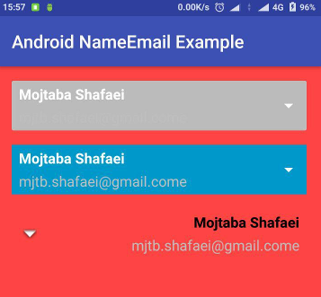

# **AndroidUserName**
An Android library to display name and email together specially in Drawer.
It Supports LTR/RTL directions.

## **Version**
1.0.0
### **Requirements**

- MIN-SDK Version = 15

### **Install**
    allprojects {
        repositories {
            ...
            maven { url 'https://jitpack.io' }
        }
    }

    dependencies {
            compile 'com.github.Mojtaba-Shafaei:AndroidUserName:1.0.0'
    }


[](https://jitpack.io/#Mojtaba-Shafaei/AndroidUserName)

### **Screenshots**



### **Sample code**
```xml
    <com.mojtaba_shafaei.android.NameEmail
        android:layout_width="match_parent"
        android:layout_height="wrap_content"
        android:layout_marginTop="16dp"
        app:arrow="@android:drawable/arrow_down_float"
        app:email="mjtb.shafaei@gmail.come"
        app:emailTextColor="@android:color/secondary_text_light_nodisable"
        app:layoutDirection="rtl"
        app:name="Mojtaba Shafaei"
        app:nameTextColor="@android:color/primary_text_light_nodisable" />
```
<!-- ## **Sample App**
[Download sample app from my drive](https://drive.google.com/file/d/0B7U-LJJvftlSZC1qRDcxeVV3N3M/view?usp=sharing) -->

## **Developer**

* **Mojtaba Shafaei** [Email](mjtb.shafaei@gmail.com)

## **License**
This project is licensed under the MIT License

